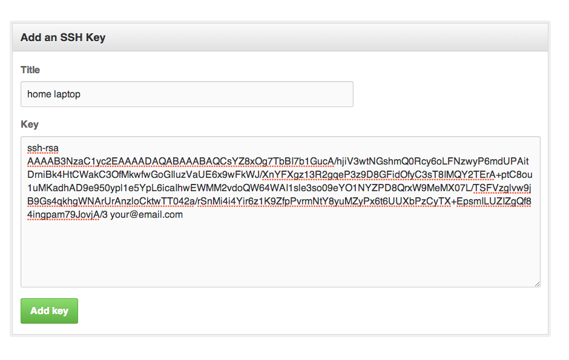
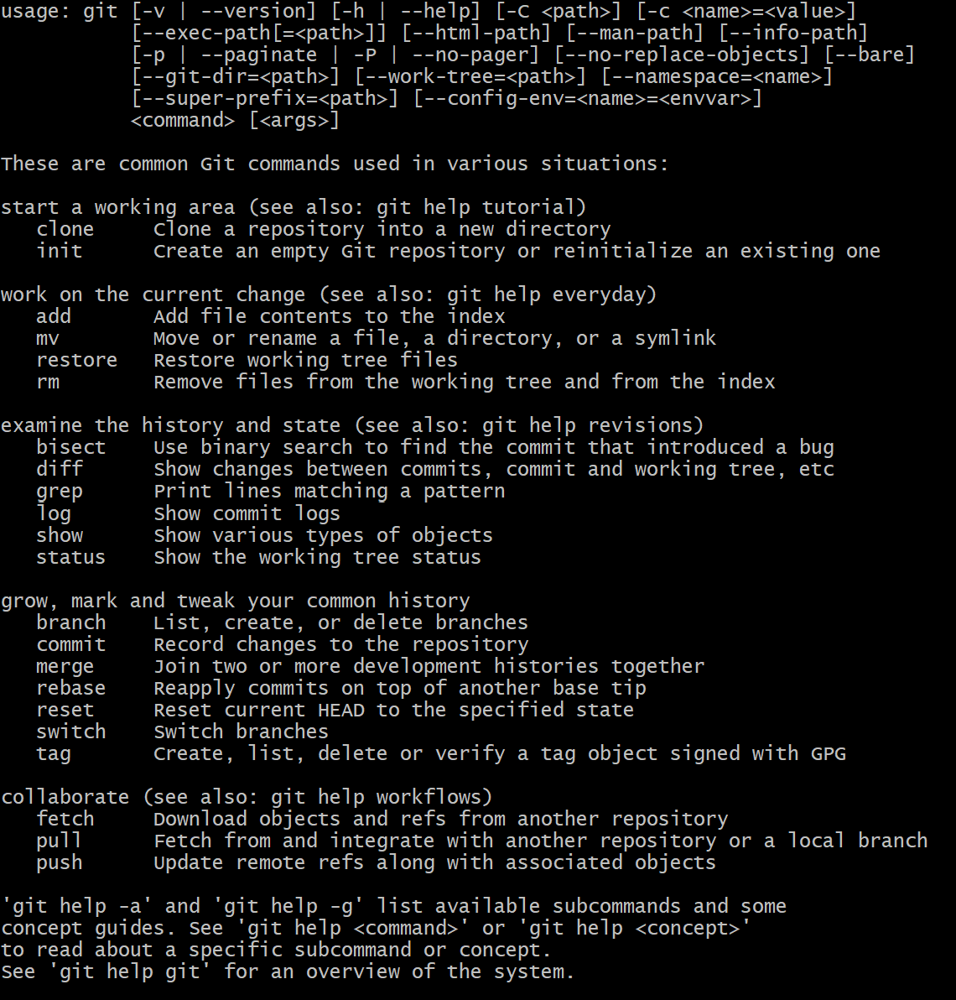

# Python Introduction

## Why Python
- Easy to learn 
- Flexible
- Efficient, fast and reliable
- Libraries and frameworks
## Python Use Cases
- Web Applications
- Data Science
- Artificial Intelligence
- Game Development
- Data Analytics
## Python Variables
Variables are containers for storing data values
- `first_name = "Mohamed" - String`
- `DOB = 99 - Integer`
- `UK_resident = yes or no - Boolean`
- `travel = 15.4 - Float`

```python
# Interact with users by taking user data in - input()
# print("Good Morning, Please Enter Your Name")
# name = input() # took user input and stored in the var called name
# print(name) # then printed the user's name

print("Good Morning, Please Enter Your Full Name") # Get user first_name and last_name
full_name = input()
print("Enter Your DOB") # User DOB
d_o_b = input()
print("Enter Your Course Name") # Course name
course_name = input()
print("Are You a UK resident?") # UK_resident
uk_resident = input()

print(full_name)
print(d_o_b)
print(course_name)
print(uk_resident)
```


## Localhost to GitHub
- Generate ssh key-pair on localhost
- Keep the private key on localhost inside .ssh folder
- Copy the public key into your repository on GitHub


# How to Set Up GitHub Using .ssh Keys

## Create GitHub SSH Keys
- The SSH keys you create for GitHub must go in the .ssh folder
- `mkdir .ssh`
- Generate a new set of keys
- `ssh-keygen -t rsa -b 4096 -C your@email.com`
- Add your SSH key to ssh-agent
```python
eval `ssh-agent -s`
ssh-agent -s
```
- Add your private key to ssh-agent
- `ssh-add ~/.ssh/id_rsa`
- Copy your public key to the clipboard
- `clip < ~/.ssh/id_rsa.pub`#
- Add your public SSH key to GitHub. Go to GitHub settings page and click the "New SSH key" button. Paste in your public (id_rsa.pub) key



## Git & GithHub
- Add changes to our GitHub repo
- `git add filename` or `git add .` - means push everyting from current location
- `git commit -m "new markdown guide added"`
- Now let's send this new data to GitHub
- `git push -u origin main`
- `git status`
- `git status`

## Git Cheat Sheet


## Intro to Data Types and Operators 
- `+ - * /`

### Comparison Operators
- `>` greater than
- `<` less than
- `==` equal to (True or False)
- `>=` greater than or equal to 
- `<=` less than or equal to 

```python
a = 24
b = 16

print(a + b) # outcome added value of a & b
print(a - b) # outcome -a from b

# Comparison
print(a > b) # True
print(a < b) # False
print(a == b) # False
```
- `(%)` The modulus operator returns the remainder of a division. The remainder is always an integer number
- `7 % 5` returns 2 
- `(!=)` returns true if the operands do not have the same value, otherwise it returns false.

```python
# Built in methods in Python - Boolean Methods
# - DRY (Do Not Repeat Yourself)

greeting = "Hello World!"
print(greeting)
print(greeting.isalpha())
print(greeting.islower()) # checks if it is lower case
print(greeting.startswith("H")) # checks if it starts with a specific character
print(greeting.endswith("!")) # checks if it ends with a specific character
```

```python
# String indexing - starts from 0
# Hello World!
# 0 1 2 3 4 5 6 7 8 9 10 11
greeting = "Hello World!"
print(greeting)
# we have a built in method that checks the len of string
print(len(greeting))
print(greeting[1])

# String Slicing
print(greeting[0:5]) # prints Hello
print(greeting[6:12]) # prints World!

print(greeting[-12:-7]) # prints Hello
print(greeting[-6:]) # prints World!
```
```python
# String Methods Available
# Use Case - var = string "bsubfaubd        "

white_space = "lot's of spaces at the end                 "
print(len(white_space))
# strip() removes the white blank spaces at the end of the string
print(len(white_space.strip()))

Example_text = "here's sOme text with lOt's of text"
print(Example_text.count("text")) # counts how many times a word has been used in a string
print(Example_text)
print(Example_text.lower()) # converts the string to lower case
print(Example_text.upper()) # converts the string to upper case
print(Example_text.capitalize()) # capitalises the first character in a string
print(Example_text.replace("with" , "," ))
```

### Concatenation & Casting

